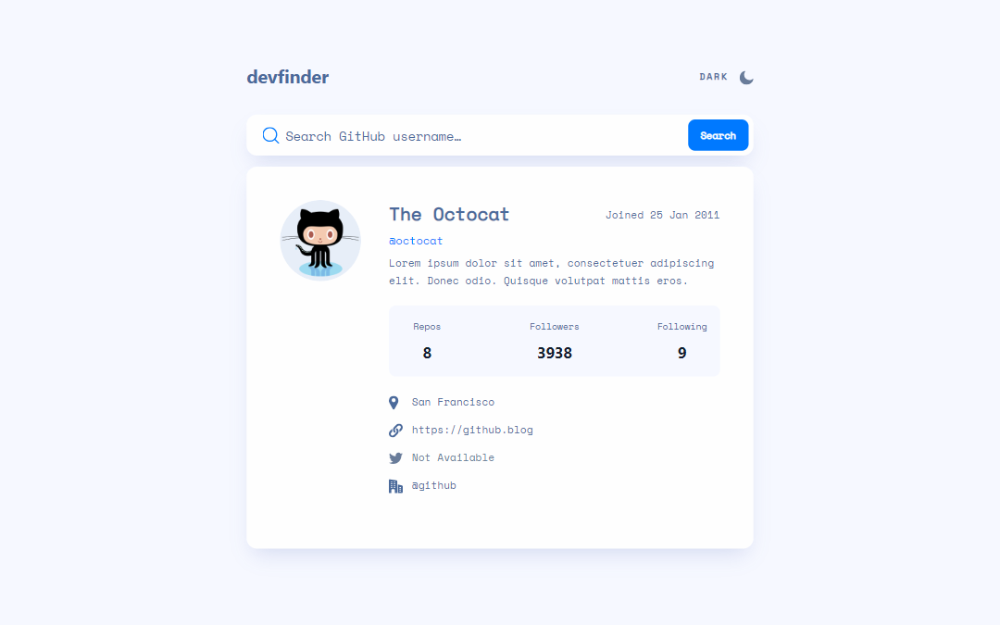

# Frontend Mentor - GitHub user search app solution

This is a solution to the [GitHub user search app challenge on Frontend Mentor](https://www.frontendmentor.io/challenges/github-user-search-app-Q09YOgaH6). Frontend Mentor challenges help you improve your coding skills by building realistic projects. 

## Table of contents

- [The challenge](#the-challenge)
- [Screenshot](#screenshot)
- [Links](#links)
- [Built with](#built-with)
- [Author](#author)

### The challenge

Users should be able to:

- View the optimal layout for the app depending on their device's screen size
- See hover states for all interactive elements on the page
- Search for GitHub users by their username
- See relevant user information based on their search
- Switch between light and dark themes
- **Bonus**: Have the correct color scheme chosen for them based on their computer preferences. _Hint_: Research `prefers-color-scheme` in CSS.

### Screenshot

### Links

- Solution URL: [Add solution URL here](https://your-solution-url.com)
- Live Site URL: [https://mell789.github.io/github-search-app/](https://mell789.github.io/github-search-app/)

### Built with

- HTML
- CSS
- Flexbox
- Mobile-first workflow
- [Bootstrap](https://getbootstrap.com/docs/5.3/getting-started/introduction/)

## Author

- Github - [Mell789](https://github.com/Mell789)
- Frontend Mentor - [@Mell789](https://www.frontendmentor.io/profile/Mell789)
